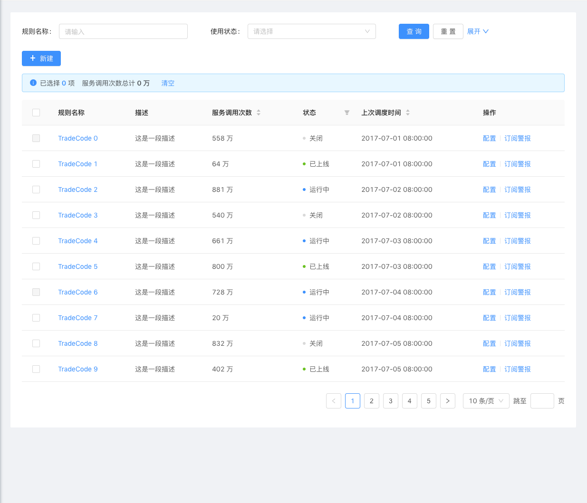

# search-table
[](https://www.npmjs.com/package/search-table)

中后台管理页通用组件 - react版

## Preview

```js
npm run start:demo
```




## Usage

```js
npm install search-table
```

```js
import SearchTable from 'search-table'


export default () => {
    const columns = [{
        title: '服务调用次数',
        dataIndex: 'callNo',
        sorter: true,
        align: 'right',
        render: (val) => `${val} 万`,
        // mark to display a total number
        needTotal: true,
        filterType: 'input'
    }]
    return (
      <SearchTable
          columns = {columns}
          dataSource = {[]}
          pagination = {{
            currentPage: 1,
            pageSize: 20,
            total: 100
          }}
          scroll = {{x: 1000}}
          moreActions = {[
            {
              text: '新建',
              onClick () {}
            }
          ]}
          onFieldsChange = {
            val => console.log(val)
          }
      />
    )
}
```

## API

### columns

|  参数   | 说明  |
|  ----  | ----  |
| filterType  | 筛选类型，支持input，select，date，range，不写则不作为筛选条件出现 |

更多参数 参照 https://ant.design/components/table-cn/#Column

### SearchTable

|  参数   | 说明  | 数据格式 |
|  ----  | ----  | ---- |
| onSearch  | 点击查询触发的回调 | ([fieldNames: string[]]) => void |
| moreActions  | 更多操作按钮，例如新建 | [{title: '按钮文案', onClick: ([fieldNames: string[]]) => void} |

更多参数 参照 https://ant.design/components/table-cn/#Table

### Pagination

参照 https://ant.design/components/pagination-cn/
